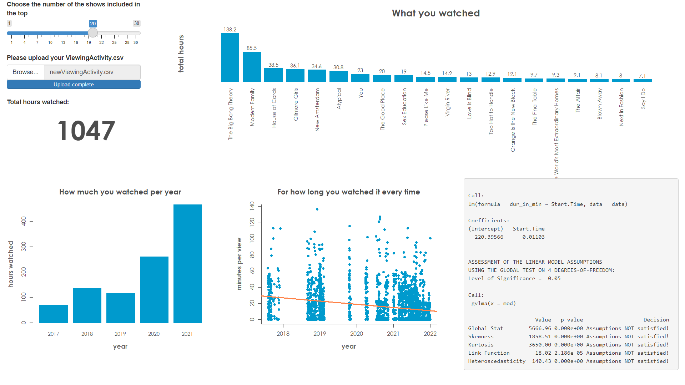
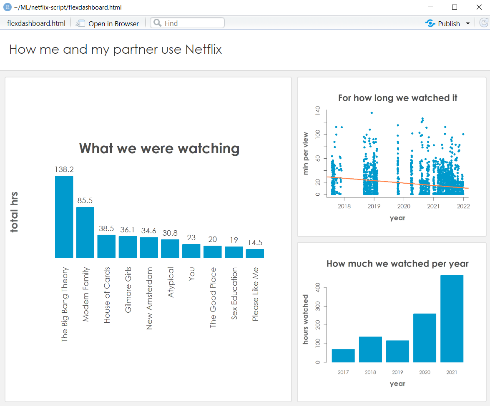

# How you use Netflix: interactive data visualization with R
There are two programs in this repository: app.R and flexdashboard.Rmd. Both programs create a user interface for R data vizualization objects. Flexdashboard is static, shiny app is interactive. One could upload their data into it and also control the number of movies included in their personal top. The app is also available [online](https://nin-khodorivsko.shinyapps.io/my_netflix_project/). Both shiny app and flexdashboard visualize top movies and tv-shows one watched on Netflix with the amount of time in hours, for how long one watched something when they did so, how many hours one watched per year. The app also builds a simple linear regression model that predicts the trend of the time spent on every video, and prints the output of the function that checks if the assumptions of the model are satisfied.

#### ShinyApp looks like this:



#### Flexdashboard looks like this:



### Access the app online
If you don't code and you want to directly use the data visualization app - go [here](https://nin-khodorivsko.shinyapps.io/my_netflix_project/). You will need to upload a file that you can get from Netflix. Netflix instructs how to do that [here](https://www.netflix.com/account/getmyinfo). After you've download the data - unzip the folder. You will find the necessary file in netflix-report/CONTENT_INTERACTION.

Concerning your data: I don't have access to it through the shiny app, but I can't truly explain what happens to it when you upload it to R servers. If you don't want to upload your data like that you could download this repository instead, install R on your computer - it's free - and run my_netflix_project/app.R. It will ask you to provide the same file, but this time it won't upload it anywhere on the Internet, the file stays on your computer. 
Alternatively, you could preprocess your ViewingActivity.csv with the code below. This way the data will not contain any information that would personally identify you, it will only contain the names of the tv shows you watched, for how long and when you watched it (without specifying who this "you" is). 
#### To anonymize your data run this in R:
```
PATH <- #PROVIDE THE PATH TO YOUR DATA HERE AS A STRING
NEW_PATH <- #PROVIDE AS A STRING THE PATH WHERE THE NEW DATA SHOULD BE STORED, INCLUDING THE NEW NAME AND .CSV
data <- read.csv(PATH)
new_data <- data[ , c("Start.Time","Duration","Title")]
write.csv(new_data, NEW_PATH, row.names = FALSE)
```
You could then upload the new, filtered data to the online app safely and get it visualized. 
### What does the code do
Processing of the data is the same in both app and dashboard. The data of the start.time variable is transformed into date objects. The data of the duration variable - into time objects. A new variable dur_in_min is created to incorporate hours, minutes and seconds into one value. A general_title variable contains filtered cleaned titles, so that, for example, "The Big Bang Theory: Season 1 Episode...." and "The Big Bang Theory: Season 5 Episode..." can be considered as instances of the same show, "The Big Bang Theory". A separate dataframe is created that aggregates duration in minutes according to these general titles. Another aggregated dataframe contains duration of viewing per year. A linear regression model is fitted with start.time as predictor and duration in minutes as outcome variables. The coefficients of the model are used for plotting the regression line, the assumptions are checked with gvlma(). 

The data is visualized with basic R graphics. Barplot(), scatterplot() and abline() are used. 
#### R packages you will need to run the code on your PC:
* shiny (if you want to run app.R)
* chron
* extrafont
* dplyr
* gvlma
* flexdashboard (if you want to run flexdashboard.Rmd)

If extrafont can't find Century Gothic - run `font_import()` . Or just enjoy the default font family :-) 

### Statistics
The model that is included in the app is really simple. Due to the number of data points the one for my data is highly significant, but the assumptions on which linear regression is based are not satisfied, so maybe one shouldn't really trust that line that much. I'm curious how it's going to work with other data though. 

Also be aware that the scatterplot visualizes duration per view as related to the date when you watched something. It means it also visualizes every time when Netflix automatically played a short piece of the video to give you a taste of it. So the line in my data, which is going down, doesn't suggest that me and my partner watch less movies now compared to 2017 but rather that maybe for some reason we watch more previews recently (which is also interesting, but it's another kind of information). The total amount of time spent on watching is represented by the other graphs and they are probably more useful for accessing what you do with your free time.

### Sources 

I'm grateful to [my partner](https://www.linkedin.com/in/soldado-koval/) for finding the Netflix data and suggesting the idea. 

I'm grateful for RStudio's [How to Start Shiny tutorial](https://shiny.rstudio.com/tutorial/) and [Using flexdashboard](https://rstudio.github.io/flexdashboard/articles/using.html) article.

I learned basic R visualization with [Learning Statistics with R](https://learningstatisticswithr.com/) by [Danielle Navarro](https://twitter.com/djnavarro).
